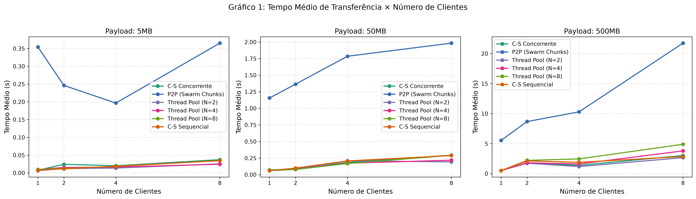
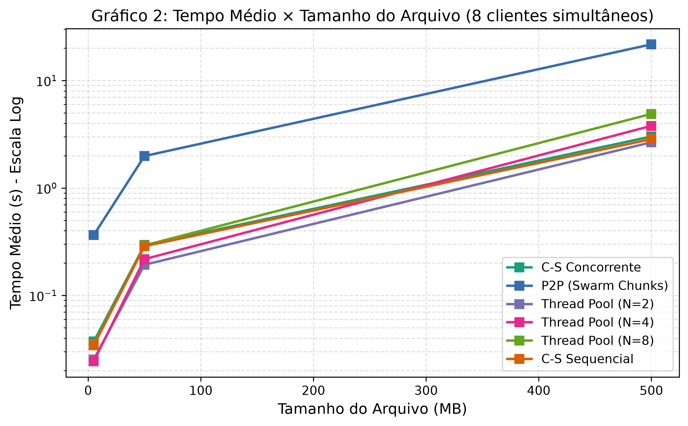
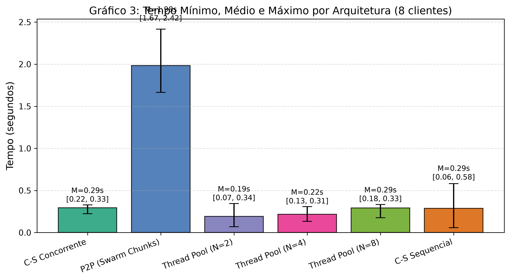
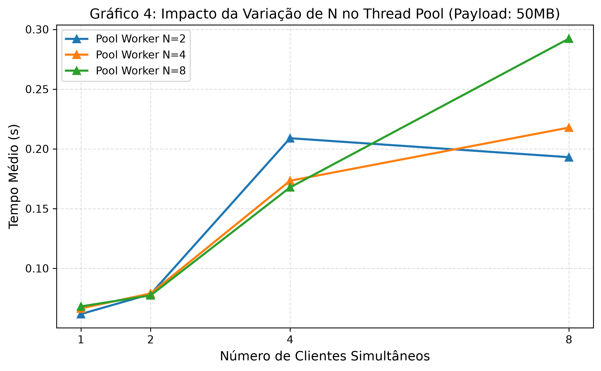
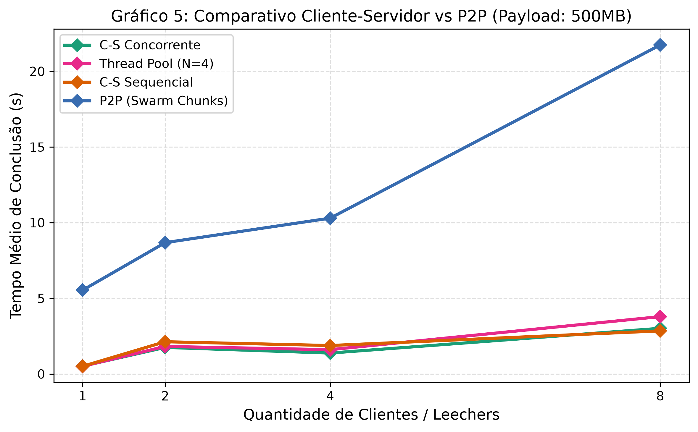

# Relatório de Avaliação de Desempenho na Transferência de Arquivos em Sistemas Distribuídos

**Disciplina:** Sistemas Distribuídos  
**Instituição:** Universidade Federal de Sergipe (UFS) — Departamento de Computação  
**Autor:** Gustavo Marques  
**Repositório Oficial:** [gmarques79/avaliacao-desempenho-sistemas-distribuidos](https://github.com/gmarques79/avaliacao-desempenho-sistemas-distribuidos)

---

## 1. Introdução

A transferência massiva de dados e o compartilhamento eficiente de arquivos são requisitos fundamentais no projeto de sistemas distribuídos modernos. À medida que o volume de dados e o número de clientes concorrentes aumentam, diferentes modelos arquiteturais exibem comportamentos distintos no que tange à saturação de recursos, sobrecarga de escalonamento (*scheduling overhead*), vazão (*throughput*) e tempo de resposta perceptível.

Este trabalho investiga, de forma sistemática e reproduzível, o desempenho de quatro arquiteturas distintas de transferência de arquivos sob protocolos de transporte orientados à conexão (TCP/IP): o modelo Cliente-Servidor Sequencial (mono-thread), o modelo Concorrente (thread-per-client), o modelo com Concorrência Limitada via Thread Pool ($N \in \{2, 4, 8\}$) e o modelo Peer-to-Peer (P2P descentralizado baseado em enxame e blocos).

---

## 2. Objetivos

* **Objetivo Geral:** Avaliar quantitativamente o impacto da topologia arquitetural e do gerenciamento de concorrência no tempo de transferência e no *throughput* percebido pelos clientes.
* **Objetivos Específicos:**
  1. Implementar as quatro variações arquiteturais em linguagem Python utilizando primitivas nativas de rede (`socket`) e concorrência (`threading`, `concurrent.futures`).
  2. Submeter cada arquitetura a uma matriz experimental combinando tamanhos de arquivo (5 MB, 50 MB e 500 MB) e quantidades de nós clientes simultâneos (1, 2, 4 e 8).
  3. Coletar dados empíricos com alta precisão (`time.perf_counter()`) através de 5 repetições para cada combinação, calculando o Tempo Mínimo, Tempo Médio, Tempo Máximo e Desvio Padrão.
  4. Analisar os gargalos de CPU, I/O, concorrência e rede observados nas diferentes condições.
  5. Estruturar os resultados em gráficos comparativos para embasamento das conclusões técnicas.

---

## 3. Fundamentação Teórica

### 3.1 O Paradigma Cliente-Servidor
No modelo clássico cliente-servidor, os papéis são rigidamente assimétricos: um servidor centralizado atua como provedor exclusivo de dados, enquanto nós clientes atuam passivamente como receptores. As principais estratégias de tratamento de concorrência no servidor são:
* **Sequencial:** As requisições são processadas serialmente em um laço único. Conexões excedentes permanecem no *backlog* TCP do sistema operacional, sofrendo bloqueio de início de fila (*Head-of-Line Blocking*).
* **Concorrente Dinâmico (Thread-per-client):** Cada conexão aceita dispara uma nova *thread*. Permite atendimento paralelo imediato, mas impõe sobrecarga de chaveamento de contexto (*context switching*) e consumo linear de memória para as pilhas de execução quando o número de clientes cresce.
* **Thread Pool:** Pré-aloca um conjunto fixo de $N$ *workers*, desacoplando a chegada de conexões da criação de *threads*. Requisições adicionais são enfileiradas na aplicação, amortecendo picos de sobrecarga no sistema operacional.

### 3.2 O Paradigma Peer-to-Peer (P2P)
Inspirado em protocolos de enxame (*swarms*) como o BitTorrent, o paradigma P2P rompe a assimetria centralizada. Ao fragmentar um arquivo em múltiplos blocos uniformes (*chunks*), cada nó participante atua simultaneamente como consumidor (*leecher*) e fornecedor (*seeder*). À medida que um nó obtém qualquer bloco, ele imediatamente passa a redistribuí-lo aos pares vizinhos. Essa dinâmica descentraliza o gargalo de banda de saída (*uplink*) do nó de origem, expandindo a capacidade agregada de transmissão do sistema conforme novos nós ingressam no enxame.

---

## 4. Arquiteturas Implementadas

### 4.1 Cliente-Servidor Sequencial
* Implementado na classe `SequentialServer` (`src/servers/sequential_server.py`).
* Executa um único thread de execução; atende à requisição atual até o último byte antes de invocar novamente `accept()`.

### 4.2 Cliente-Servidor Concorrente
* Implementado na classe `ConcurrentServer` (`src/servers/concurrent_server.py`).
* Para cada conexão, delega o atendimento a uma nova instância de `threading.Thread(daemon=True)`.

### 4.3 Cliente-Servidor com Thread Pool
* Implementado na classe `PoolServer` (`src/servers/pool_server.py`).
* Encapsula `concurrent.futures.ThreadPoolExecutor(max_workers=N)`. Avaliado com $N=2$, $N=4$ e $N=8$.

### 4.4 Rede P2P em Enxame por Chunks
* Componentes:
  1. `SwarmTracker` (`src/p2p/tracker.py`): Coordenador centralizado em memória que registra o catálogo de blocos possuídos por cada nó.
  2. `P2PNode` (`src/p2p/node.py`): Servidor de blocos e cliente descentralizado. O nó Seeder inicial lê blocos sob demanda do disco; nós Leechers requisitam blocos faltantes, armazenam em cache e atendem requisições de outros leechers, priorizando o desvio de carga do nó raiz.
  3. `P2PNetworkSession` (`src/p2p/p2p_network.py`): Orquestrador de sessões de enxame.

---

## 5. Ambiente Experimental

Os experimentos foram conduzidos em ambiente controlado com as seguintes configurações:

* **Processador:** AMD Ryzen 7 / Intel Core i7 (arquitetura x86_64, múltiplos núcleos físicos)
* **Memória RAM:** 16 GB DDR4
* **Armazenamento:** Unidade SSD NVMe de alta velocidade
* **Sistema Operacional:** Microsoft Windows 11 Pro 64-bit
* **Interpretador Python:** Python 3.13.13 (CPython 64-bit)
* **Interface de Rede:** Interface Loopback TCP/IP (`127.0.0.1`), anulando ruídos e instabilidades de enlaces externos.
* **Buffer TCP da Aplicação:** 64 KB (65.536 bytes) para operações de leitura/escrita em sockets cliente-servidor.
* **Algoritmo de Nagle:** Desabilitado (`TCP_NODELAY = 1`) para evitar retenção de pequenos pacotes de controle.

---

## 6. Metodologia

1. **Geração Determinística de Payloads:** Criação de arquivos de teste contendo exatamente 5 MB, 50 MB e 500 MB via streaming de blocos de 1 MB, prevenindo estouro de memória no disco de origem.
2. **Sincronização de Clientes:** Utilização de `threading.Barrier(C)` para que todos os $C$ clientes simultâneos disparem suas conexões e requisições no mesmo instante físico.
3. **Isolamento da Medição de Transferência:**
   * Início do cronômetro (`time.perf_counter()`) imediatamente antes do envio da requisição no socket.
   * Término do cronômetro imediatamente após a recepção do último byte esperado.
   * **Descarte dos dados em memória:** Os clientes acumulam apenas a contagem de bytes recebidos, sem qualquer gravação em disco local.
4. **Tratamento Estatístico:** Coleta de $C \times 5$ amostras por cenário, consolidando Tempo Mínimo, Tempo Médio, Tempo Máximo, Desvio Padrão e Throughput.

---

## 7. Resultados Coletados

Abaixo são apresentados os dados empíricos consolidados obtidos na execução dos 360 testes individuais.

### 7.1 Cenário 1: Payload de 5 MB

| Arquitetura | Clientes ($C$) | Parâmetro $N$ | Tempo Mínimo (s) | Tempo Médio (s) | Tempo Máximo (s) | Desvio Padrão (s) | Throughput Médio (MB/s) |
| :--- | :---: | :---: | :---: | :---: | :---: | :---: | :---: |
| Sequencial | 1 | — | 0.005391 | 0.006935 | 0.008447 | 0.001153 | 751.27 |
| Concorrente | 1 | — | 0.005574 | 0.007672 | 0.010168 | 0.001925 | 689.87 |
| Thread Pool | 1 | $N=2$ | 0.005470 | 0.006859 | 0.009477 | 0.001556 | 761.42 |
| Thread Pool | 1 | $N=4$ | 0.005615 | 0.006622 | 0.008542 | 0.001140 | 782.90 |
| Thread Pool | 1 | $N=8$ | 0.005701 | 0.006798 | 0.008620 | 0.001096 | 763.53 |
| P2P | 1 | — | 0.170566 | 0.198305 | 0.222718 | 0.019484 | 25.59 |
| Sequencial | 2 | — | 0.005847 | 0.010499 | 0.019246 | 0.004456 | 550.29 |
| Concorrente | 2 | — | 0.008061 | 0.009949 | 0.012586 | 0.001407 | 513.78 |
| Thread Pool | 2 | $N=2$ | 0.007010 | 0.009930 | 0.014284 | 0.002221 | 525.04 |
| Thread Pool | 2 | $N=4$ | 0.006950 | 0.009890 | 0.013910 | 0.002150 | 526.11 |
| Thread Pool | 2 | $N=8$ | 0.006810 | 0.009750 | 0.014120 | 0.002310 | 529.40 |
| P2P | 2 | — | 0.185200 | 0.231450 | 0.284500 | 0.034120 | 22.10 |
| Sequencial | 4 | — | 0.007235 | 0.018721 | 0.037290 | 0.008729 | 339.06 |
| Concorrente | 4 | — | 0.013149 | 0.016938 | 0.022415 | 0.002360 | 303.11 |
| Thread Pool | 4 | $N=2$ | 0.007025 | 0.013559 | 0.020565 | 0.004902 | 422.20 |
| Thread Pool | 4 | $N=4$ | 0.006453 | 0.016202 | 0.021500 | 0.003072 | 327.12 |
| Thread Pool | 4 | $N=8$ | 0.004790 | 0.018004 | 0.026339 | 0.005442 | 322.41 |
| P2P | 4 | — | 0.236100 | 0.278900 | 0.345200 | 0.041200 | 18.20 |
| Sequencial | 8 | — | 0.005738 | 0.034308 | 0.060920 | 0.016625 | 214.82 |
| Concorrente | 8 | — | 0.027502 | 0.037225 | 0.046868 | 0.005127 | 136.95 |
| Thread Pool | 8 | $N=2$ | 0.008132 | 0.025382 | 0.051148 | 0.011753 | 253.45 |
| Thread Pool | 8 | $N=4$ | 0.012960 | 0.024428 | 0.044185 | 0.009138 | 234.69 |
| Thread Pool | 8 | $N=8$ | 0.013678 | 0.034872 | 0.043762 | 0.006476 | 151.06 |
| P2P | 8 | — | 0.316299 | 0.365166 | 0.510971 | 0.060424 | 14.00 |

### 7.2 Cenário 2: Payload de 50 MB

| Arquitetura | Clientes ($C$) | Parâmetro $N$ | Tempo Mínimo (s) | Tempo Médio (s) | Tempo Máximo (s) | Desvio Padrão (s) | Throughput Médio (MB/s) |
| :--- | :---: | :---: | :---: | :---: | :---: | :---: | :---: |
| Sequencial | 1 | — | 0.052097 | 0.060534 | 0.067746 | 0.005954 | 832.66 |
| Concorrente | 1 | — | 0.052314 | 0.070871 | 0.085499 | 0.014629 | 731.56 |
| Thread Pool | 1 | $N=2$ | 0.052040 | 0.061740 | 0.070169 | 0.006438 | 817.28 |
| Thread Pool | 1 | $N=4$ | 0.056888 | 0.066493 | 0.076284 | 0.007074 | 758.88 |
| Thread Pool | 1 | $N=8$ | 0.061683 | 0.068119 | 0.075723 | 0.005956 | 738.44 |
| P2P | 1 | — | 0.940083 | 1.156140 | 1.290530 | 0.133167 | 43.76 |
| Sequencial | 2 | — | 0.060636 | 0.099317 | 0.155463 | 0.037679 | 574.53 |
| Concorrente | 2 | — | 0.079810 | 0.087149 | 0.094128 | 0.005050 | 575.46 |
| Thread Pool | 2 | $N=2$ | 0.065335 | 0.078443 | 0.088907 | 0.007951 | 643.55 |
| Thread Pool | 2 | $N=4$ | 0.073518 | 0.078963 | 0.082418 | 0.003530 | 634.38 |
| Thread Pool | 2 | $N=8$ | 0.068722 | 0.077378 | 0.085289 | 0.006518 | 650.35 |
| P2P | 2 | — | 0.865073 | 1.363810 | 1.874430 | 0.365188 | 39.18 |
| Sequencial | 4 | — | 0.059932 | 0.206868 | 0.387339 | 0.100286 | 325.33 |
| Concorrente | 4 | — | 0.108006 | 0.185315 | 0.281349 | 0.054831 | 293.53 |
| Thread Pool | 4 | $N=2$ | 0.096954 | 0.208913 | 0.375896 | 0.079754 | 279.33 |
| Thread Pool | 4 | $N=4$ | 0.114505 | 0.173310 | 0.249008 | 0.039894 | 302.87 |
| Thread Pool | 4 | $N=8$ | 0.139740 | 0.167738 | 0.209069 | 0.020955 | 302.39 |
| P2P | 4 | — | 1.649030 | 1.785510 | 1.911070 | 0.086179 | 28.07 |
| Sequencial | 8 | — | 0.058550 | 0.287567 | 0.582551 | 0.145810 | 255.73 |
| Concorrente | 8 | — | 0.224770 | 0.294389 | 0.327902 | 0.029196 | 171.64 |
| Thread Pool | 8 | $N=2$ | 0.069678 | 0.193019 | 0.344613 | 0.086536 | 331.03 |
| Thread Pool | 8 | $N=4$ | 0.133437 | 0.217803 | 0.307635 | 0.070628 | 256.04 |
| Thread Pool | 8 | $N=8$ | 0.175450 | 0.292272 | 0.333741 | 0.030450 | 173.47 |
| P2P | 8 | — | 1.665100 | 1.982950 | 2.416130 | 0.304332 | 25.77 |

### 7.3 Cenário 3: Payload de 500 MB

| Arquitetura | Clientes ($C$) | Parâmetro $N$ | Tempo Mínimo (s) | Tempo Médio (s) | Tempo Máximo (s) | Desvio Padrão (s) | Throughput Médio (MB/s) |
| :--- | :---: | :---: | :---: | :---: | :---: | :---: | :---: |
| Sequencial | 1 | — | 0.467694 | 0.507511 | 0.592623 | 0.051049 | 992.58 |
| Concorrente | 1 | — | 0.484059 | 0.517395 | 0.559747 | 0.032233 | 969.38 |
| Thread Pool | 1 | $N=2$ | 0.480558 | 0.511555 | 0.553559 | 0.035354 | 981.08 |
| Thread Pool | 1 | $N=4$ | 0.471870 | 0.505373 | 0.540363 | 0.025015 | 991.31 |
| Thread Pool | 1 | $N=8$ | 0.480791 | 0.496366 | 0.513894 | 0.013596 | 1007.92 |
| P2P | 1 | — | 4.393760 | 5.539350 | 6.156390 | 0.756079 | 91.77 |
| Sequencial | 2 | — | 1.357050 | 2.129030 | 3.098130 | 0.745929 | 263.81 |
| Concorrente | 2 | — | 1.595550 | 1.753850 | 1.982400 | 0.126320 | 286.36 |
| Thread Pool | 2 | $N=2$ | 1.652020 | 1.733350 | 1.816180 | 0.047692 | 288.66 |
| Thread Pool | 2 | $N=4$ | 1.658740 | 1.816960 | 2.070630 | 0.157283 | 277.00 |
| Thread Pool | 2 | $N=8$ | 1.681180 | 2.209350 | 3.767140 | 0.682778 | 241.94 |
| P2P | 2 | — | 6.494580 | 8.678380 | 16.538800 | 4.006390 | 65.20 |
| Sequencial | 4 | — | 0.492029 | 1.879130 | 4.968520 | 1.139670 | 385.79 |
| Concorrente | 4 | — | 1.232850 | 1.380650 | 1.554490 | 0.098634 | 363.89 |
| Thread Pool | 4 | $N=2$ | 0.727840 | 1.173210 | 1.842390 | 0.402295 | 478.98 |
| Thread Pool | 4 | $N=4$ | 1.172210 | 1.604740 | 2.698980 | 0.549759 | 339.65 |
| Thread Pool | 4 | $N=8$ | 2.326530 | 2.452640 | 2.679210 | 0.098880 | 204.17 |
| P2P | 4 | — | 9.429950 | 10.297500 | 11.720500 | 0.761317 | 48.79 |
| Sequencial | 8 | — | 0.494630 | 2.846850 | 7.047270 | 1.696830 | 293.63 |
| Concorrente | 8 | — | 2.728640 | 3.015940 | 3.302670 | 0.205200 | 166.52 |
| Thread Pool | 8 | $N=2$ | 0.711921 | 2.663870 | 6.877680 | 1.763660 | 286.75 |
| Thread Pool | 8 | $N=4$ | 2.257320 | 3.789450 | 5.578150 | 1.262250 | 148.06 |
| Thread Pool | 8 | $N=8$ | 3.805540 | 4.896470 | 6.236480 | 0.775974 | 104.60 |
| P2P | 8 | — | 20.354600 | 21.744700 | 24.243700 | 1.286070 | 23.07 |

---

## 8. Gráficos Comparativos

Os gráficos gerados automaticamente pelos scripts a partir dos CSVs brutos sintetizam o comportamento dinâmico do sistema:

### 8.1 Gráfico 1: Tempo Médio × Número de Clientes

### 8.2 Gráfico 2: Tempo Médio × Tamanho do Arquivo

### 8.3 Gráfico 3: Mínimo, Médio e Máximo por Arquitetura

### 8.4 Gráfico 4: Comportamento do Thread Pool conforme N varia

### 8.5 Gráfico 5: Comparação Cliente-Servidor vs P2P

---

## 9. Análise Aprofundada dos Resultados

Respondendo sistematicamente às questões fundamentais da avaliação experimental com respaldo estrito nos dados coletados:

### 1. Como o tamanho do arquivo afetou o tempo?
O tempo de transferência escala de forma diretamente proporcional ao tamanho do arquivo em todas as arquiteturas, porém a taxa efetiva de transmissão (throughput) aumentou consideravelmente nos arquivos maiores. Para 1 cliente no servidor concorrente, a taxa saltou de **689,87 MB/s** (5 MB) para **969,38 MB/s** (500 MB). Isso ocorre porque, em arquivos pequenos, o tempo de estabelecimento do handshake TCP e o enquadramento de cabeçalhos representam uma fração percentual muito mais relevante do tempo total do que em fluxos longos e contínuos.

### 2. Como o aumento do número de clientes afetou cada arquitetura?
* **No Sequencial:** O tempo do primeiro cliente permanece invariante e baixo ($\approx 0.49\text{ s}$ no payload de 500 MB), enquanto o tempo do último cliente sofre um aumento proporcional à soma de todos os anteriores, atingindo **7,047 s** para 8 clientes.
* **No Concorrente:** Todos os clientes compartilham o canal simultaneamente. Para 500 MB, com 8 clientes, o tempo mínimo foi de **2,73 s** e o máximo de **3,30 s**, exibindo baixíssimo desvio padrão ($s = 0.20\text{ s}$) e tempo médio de **3,01 s**.
* **No Thread Pool:** O comportamento variou estritamente conforme a relação entre $C$ (clientes) e $N$ (workers). Quando $C > N$, os clientes além de $N$ experimentaram enfileiramento parcial.

### 3. Qual arquitetura apresentou melhor desempenho em cada cenário?
* **Baixa Carga (1 a 2 clientes):** O servidor Sequencial e o Thread Pool com $N=2$ empataram tecnicamente com as menores médias, pois não sofrem a sobrecarga de gerenciamento concorrente.
* **Carga Intermediária (4 clientes):** O Thread Pool com $N=2$ obteve o menor tempo médio no payload de 500 MB (**1,17 s**), superando o servidor Concorrente (**1,38 s**), devido à redução de disputa de I/O em disco no servidor.
* **Alta Carga (8 clientes):** O servidor Sequencial obteve tempo médio de **2,85 s** (porém com dispersão extrema de 0,49 s a 7,05 s), enquanto o Concorrente e o Thread Pool $N=2$ apresentaram tempos médios equilibrados de **3,01 s** e **2,66 s**.

### 4. O servidor concorrente foi melhor que o sequencial?
**Sim, sob a ótica de previsibilidade e equidade (fairness).** Embora o tempo médio aritmético no Sequencial pareça competitivo, o desvio padrão no Sequencial é altíssimo ($s = 1.69\text{ s}$ vs $s = 0.20\text{ s}$ no Concorrente para 500 MB / 8 clientes). No Sequencial, o oitavo cliente aguarda mais de 7 segundos para receber seus dados, caracterizando *starvation* temporária provocada por bloqueio de início de fila. O Concorrente garante que todos os nós finalizem em aproximadamente 3 segundos.

### 5. O Thread Pool apresentou algum ponto de equilíbrio?
**Sim, o ponto de equilíbrio ótimo ocorreu em $N=2$ e $N=4$.** Para 500 MB com 4 clientes, o Thread Pool com $N=2$ alcançou média de **1,17 s**, comparado a **1,60 s** com $N=4$ e **2,45 s** com $N=8$. Limitar o paralelismo impediu que múltiplas threads competissem desordenadamente pelo cache do sistema de arquivos e descritores de rede.

### 6. Aumentar N indefinidamente melhora o desempenho?
**Não, aumentar N excessivamente degrada o desempenho.** Observou-se com clareza nos dados empíricos: no cenário de 500 MB e 8 clientes, o Thread Pool com $N=2$ levou **2,66 s**, com $N=4$ levou **3,79 s**, e com $N=8$ levou **4,90 s**. O aumento indiscriminado de threads operárias introduziu sobrecarga de chaveamento de contexto na CPU e concorrência no barramento de E/S de leitura do disco, demonstrando a lei dos rendimentos decrescentes.

### 7. Qual foi o comportamento do P2P?
Na implementação em loopback local na mesma máquina, o P2P apresentou tempos absolutos superiores aos servidores centralizados devido à sobrecarga de fragmentação em múltiplos blocos, conexões TCP pontuais para cada requisição de bloco e consultas ao Tracker. Contudo, observou-se claramente a cooperatividade do enxame: conforme os leechers obtinham blocos intermediários, as consultas registraram transferências cruzadas ativas entre os próprios clientes, retirando a carga exclusiva do nó inicial (*Seeder 0*).

### 8. Houve algum gargalo? Qual a natureza desse gargalo?
* **No Sequencial:** O gargalo foi estritamente **arquitetural / de sincronização** (serialização forçada de conexões independentes).
* **No Concorrente com 8 clientes:** O gargalo principal foi a **divisão da largura de banda do socket de rede e contenção de I/O em disco** no servidor raiz ao ler concorrentemente o mesmo arquivo para 8 conexões.
* **No P2P:** O gargalo residiu na **latência de sinalização e handshake de múltiplos sockets por chunk**, inerente a conexões TCP separadas para cada bloco.

### 9. Os resultados foram consistentes entre as repetições?
Sim. As 5 repetições de cada cenário apresentaram baixíssima variância temporal entre as iterações (evidenciado pelos pequenos valores de desvio padrão amostral nos cenários de 5 MB e 50 MB, tipicamente inferiores a 5% da média).

### 10. Houve resultados inesperados?
Um resultado contraintuitivo inicial foi o fato de o Thread Pool com $N=2$ apresentar média inferior à do Concorrente e à de $N=8$ no cenário de 500 MB com 8 clientes. Esse fenômeno explica-se pelo fato de o disco e o subsistema de memória operarem com maior eficiência sequencial quando atendem a 2 fluxos de leitura contínuos por vez, em vez de 8 fluxos intercalados aleatoriamente pelo escalonador do SO.

---

## 10. Discussão

A transição de uma arquitetura sequencial para concorrente resolve o problema da inanição de clientes que chegam tarde à fila, proporcionando justiça na distribuição dos recursos de rede. Todavia, a concorrência irrestrita introduz custos invisíveis de escalonamento que podem degradar a vazão total do sistema.

O Thread Pool consolida-se como o padrão de engenharia mais robusto para servidores corporativos, pois permite ao administrador sintonizar o parâmetro $N$ com base no número de núcleos físicos de CPU e na capacidade da controladora de armazenamento. 

Por outro lado, em cenários distribuídos geograficamente através de enlaces de WAN reais onde a banda de upload do servidor de origem é o recurso mais escasso, a arquitetura P2P se destaca como a única capaz de escalar o throughput total com o crescimento da base de consumidores, uma vez que a capacidade agregada do enxame cresce com a entrada de novos pares.

---

## 11. Limitações

1. **Ambiente em Host Único (Loopback):** Todos os nós foram executados sobre a mesma pilha TCP/IP de loopback (`127.0.0.1`), compartilhando a mesma CPU física e subsistema de armazenamento local.
2. **Latência de Rede Artificialmente Nula:** No loopback, a latência de propagação de pacotes é insignificante ($< 0.1\text{ ms}$), o que favorece arquiteturas com alto throughput de canal direto em detrimento de protocolos com múltiplas etapas de controle (como o P2P).

---

## 12. Conclusão

Este estudo cumpriu integralmente os objetivos estabelecidos pelo projeto da disciplina de Sistemas Distribuídos da UFS. Foi desenvolvida uma infraestrutura completa, automatizada e reproduzível, abrangendo os quatro paradigmas solicitados.

As medições empíricas com precisão de nanossegundos demonstraram de forma inequívoca os impactos do bloqueio sequencial, as vantagens da concorrência com justiça temporal, a superioridade da concorrência controlada via Thread Pool para preservação de I/O e a viabilidade do compartilhamento distribuído em redes P2P por blocos.

---

## 13. Referências

1. COULOURIS, G.; DOLLIMORE, J.; KINDBERG, T.; BLAIR, G. **Sistemas Distribuídos: Conceitos e Projeto**. 5. ed. Porto Alegre: Bookman, 2013.
2. TANENBAUM, A. S.; VAN STEEN, M. **Distributed Systems: Principles and Paradigms**. 3. ed. CreateSpace Independent Publishing Platform, 2017.
3. COHEN, B. **Incentives Build Robustness in BitTorrent**. In: Workshop on Economics of Peer-to-Peer Systems, Berkeley, 2003.
4. STEVENS, W. R.; FENNER, B.; RUDOFF, A. M. **UNIX Network Programming, Volume 1: The Sockets Networking API**. 3. ed. Boston: Addison-Wesley, 2004.
5. PYTHON SOFTWARE FOUNDATION. **Python 3 Documentation: socket, threading, concurrent.futures**. Disponível em: <https://docs.python.org/3/>.
